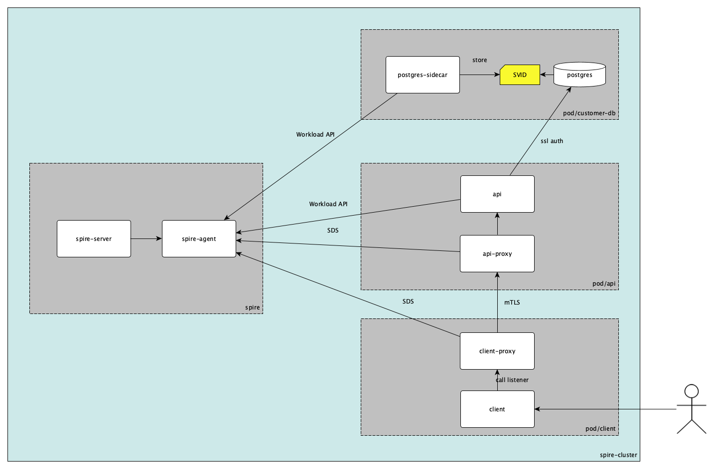

# SPIRE K8S database

### What are we going to show?

The objective of this example is to demonstrate how we can use SPIRE in a Kubernetes environment to provide identities to different microservices and use mTLS between them.

### Demo

##### Description

This demo has 4 namespaces `spire`, `postgres-ns`, `api-ns` and `client-ns` 

[server](k8s/spire/server/spire-server.yaml) is configured with `k8s_psat` node attestor to validate identity of agents and [agent](k8s/spire/agent/spire-agent.yaml) has `k8s` workload attestor to validate identity of microservices using workload API and SDS.

[Customer-db](k8s/demo/postgres-db.yaml) contains a postgresql database with ssl mode, that uses SVIDs provided to authenticate postgres users that are trying to connect to database, and a postgres-sidecar (spiffe-helper) that attest against Workload API and store SVIDs on disk and rotates certificates calling [reload.sh](k8s/demo/postgres-db.yaml#52).

[api](k8s/demo/api.yaml) this pod contains a REST API that attest using Workload API and present SVIDs to postgres to authenticate `symuser` (SVID has a DNS with postgres user to authenticate), and an Envoy, configured to use SDS endpoint and uses it in mTLS redirecting to API.

The last part is the [client](k8s/demo/client.yaml) pod, that contains a CMD client for REST API, and an Envoy that is configured with SDS endpoint and mTLS agains api proxy.

Diagram

##### Namespaces
- spire
   - spire-server-0: SPIRE Server statefulSet
   - spire-agent-xxxx: agents daemonseat
- postgres-ns
   - customer-db-0: customer database pod
      - postgres: postgresql database, configured for SSL authentication
      - postgres-sidecar: spiffe-helper that attest against SPIRE Agent and stores SVID on disk
- api-ns
   - api-xxxx-xxx: api pod
      - api: REST API that attest against SPIRe Agent and presents SVID to postgres
      - api-proxy: Envoy container configured to get SVIDs using SPIRE Agent SDS in a mTLS listener
- client-ns
   - client-xxxx-xxxx: client pod
      - client: simple REST API client
      - client-proxy: Envoy container configured to get SVIDs using SPIRE Agent SDS, and connect to api-proxy with mTLS

##### Entries

All entries are created using [entries.json](../../entries.json)

###### Agent entry
Entry used to put an alias to our Agent, in this example we are using [k8_psat](https://github.com/spiffe/spire/blob/main/doc/plugin_server_nodeattestor_k8s_psat.md) node attestor
- `spifeID: spiffe://example.org/spire-agent-node` node SPIFFE ID
- `parentID: spiffe://example.org/spire/server` all `nodes` must have Server as parent
- `selector: k8s_psat:agent_ns:spire` agent must be in namespace `spire`
- `selector: k8s_psat:agent_sa:spire-agent` agent must use service account `spire-agent`
- `selector: k8s_psat:cluster:spire-cluster`: agent must be in cluster `spire-cluster`

###### Postgres Sidecar entry
- `parentID: spiffe://example.org/spire-agent-node`: agent SPIFFE ID
- `spiffeID: spiffe://example.org/postgres-sidecar`: SVID SPIFFE ID
- `selector: k8s:container-name:postgres-sidecar`: workload must be in container `postgres-sidecar`
- `selector: k8s:ns:postgres-ns`: workload must be in namespace `postgres-ns`
- `ttl 60`: SVIDs expires in 60 seconds

###### Api Sidecar entry
- `parentID spiffe://example.org/spire-agent-node`: node SPIFFE ID
- `spiffeID spiffe://example.org/api`: SVID SPIFFE ID
- `selector k8s:container-name:api`: workload must be in container `api`
- `selector k8s:ns:api-ns`: workload must be in namespace `api-ns`
- `dns symuser`: SVID used to validate users on Postgres must contains the user name they want to authenticate as a DNS
- `ttl 60`: SVIDs expires in 60 seconds

###### Api proxy
- `parentID spiffe://example.org/spire-agent-node`: node SPIFFE ID
- `spiffeID spiffe://example.org/api-proxy`: SVID SPIFFE ID
- `selector k8s:container-name:api-proxy`: workload must be in container `api-proxy`
- `selector k8s:ns:api-ns`: workload must be in namespace `api-ns`
- `ttl 60`: SVIDs expires in 60 seconds

###### Client proxy
- `parentID spiffe://example.org/spire-agent-node`: node SPIFFE ID
- `spiffeID spiffe://example.org/client-proxy`: SPIFFE ID del SVID
- `selector k8s:container-name:client-proxy`: workload must be in container `client-proxy`
- `selector k8s:ns:client-ns`: workload must be in namespace `client-ns`
- `ttl 60`: SVIDs expires in 60 seconds

### Steps
For this example we uses `kind` with a cluster that allows the use of `psat`

1. `1-cluster-create.sh`: download all dependencies and creates a cluster (using kind). In case `kind` or `kubectl` this script download them on folder `./bin`, creates a link to them if exists.
2. `2-build-images.sh`: build required images (spiffe-helper, api y client).
3. `3-deploy.sh`: add images to kind and creates namespaces with all required entries.
4. `4-call-client.sh`: call CLI to get customers from postgres.
5. `5-make-db-fails.sh`: updates DNS for postgres SVID to an invalid user. To validate connection is broken execute `4-call-client.sh`, getting status `500`.
6. `6-make-envoy-mtls-fails.sh`: update selector on api-proxy entry, to prevent api-proxy to get new SVIDs, after ~1m call `4-call-client.sh` to get status `503`.
7. `7-restore-entries.sh`: restore entries to initial state. After some seconds execute `4-call-client.sh` to verify cient is able to connect postgres again.
8. `8-cluster-delete.sh`: delete cluster.
