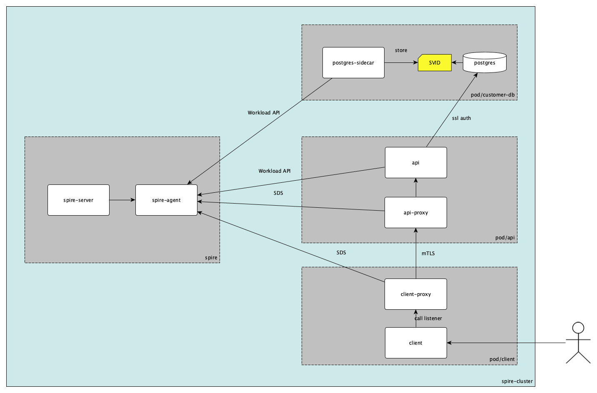

# SPIRE K8S database

### Que vamos a mostrar?

El objetivo de este ejemplo es poder demostrar cómo es posible utilizar SPIRE en un Kubernetes environment para proveer de forma segura de identidades a servicios y utilizarlos para realizar mTls entre los mismos

### Detalles del escenario

##### Descripción

El escenario consta de 4 namespaces `spire`, `postgres-ns`, `api-ns` y `client-ns`.

El [server](k8s/spire/server/spire-server.yaml) esta configurado con `k8s_psat` node attestor para validar la identidad del agent y el [agent](k8s/spire/agent/spire-agent.yaml) por su parte con `k8s` workload attestor, que es utilizado para validar la identidad del servicio que estamos attestando.

[Customer-db](k8s/demo/postgres-db.yaml) contiene un postgresql database configurado en ssl mode, para poder utilizar certificados para autenticar el usuario que está llamando la base de datos, y el postgres-sidecar es un spiffe-helper que es el q attesta contra el spire-agent guarda el SVID en disco y utlizando [reload.sh](k8s/demo/postgres-db.yaml#52) para notificar a la bd que rote los certificados.

[api](k8s/demo/api.yaml) aquí es donde todo se conecta, este pod contiene una REST API que se attesta contra el agent utilizando la WorkloadAPI, guarda el X.509 SVID en disco y lo presenta al postgresql para identificar al usuario (el SVID tiene un dns con el nombre del usuario al que representa), A su vez en el pod hay un Envoy, que se encuentra configurado para utilizar SDS endpoint y obtener SVIDs desde el agent, y un listener que valida al caller utilizando mTLS y redirecciona a la API

Por ultimo tenemos al pod del [cliente](k8s/demo/client.yaml), el cual contiene un client de la REST API, el cual llama al Envoy, también configurado con SDS, que se encuentra en el mismo pod y realiza un mTLS contra el Envoy en la API.

El siguiente es un diagrama simplificado mostrando el K8S cluster con sus nodos.

##### Namespaces
- spire
   - spire-server-0: SPIRE Server statefulSet
   - spire-agent-xxxx: agents daemonseat
- postgres-ns
   - customer-db-0: customer database pod
      - postgres: postgresql database, configurada para aceptar SSL authentication
      - postgres-sidecar: spiffe-helper que attesta contra SPIRE agent y guarda SVID en disco y se comunica con postgres para recargar certificados
- api-ns
   - api-xxxx-xxx: api pod
      - api: REST API que attesta contrar el agent y presenta el X.509 SVID al postgres
      - api-proxy: Envoy container configurado para obtener SVIDs desde  SPIRE Agent SDS y un mTLS listener para acceder a la api
- client-ns
   - client-xxxx-xxxx: client pod
      - client: simple REST API client
      - client-proxy: Envoy container configurado para obtener SVIDs desde  SPIRE Agent SDS,  y conectar con api-proxy utilizando mTLS 

##### Entries
Por ahora solo hemos hablado de la configuración de los pods pero no de las entries utilizadas para poder attestar los servicios.
Entries son creadas utilizando [entries.json](../../entries.json)

###### Agent entry
Esta entry es la que nos permite configurar un alias al agent, en este ejemplo estamos utilizando [k8_psat](https://github.com/spiffe/spire/blob/main/doc/plugin_server_nodeattestor_k8s_psat.md) node attestor
- `spifeID: spiffe://example.org/spire-agent-node` alias del agent
- `parentID: spiffe://example.org/spire/server` todos los `nodes` tienen que tener como padre al server
- `selector: k8s_psat:agent_ns:spire` el agent debe de estar en el namespace `spire`
- `selector: k8s_psat:agent_sa:spire-agent` el agent debe de utilizar la service account `spire-agent`
- `selector: k8s_psat:cluster:spire-cluster`: el agent debe de estar en el cluster `spire-cluster`
- `node`: está entry es utilizada para node attestation

###### Postgres Sidecar entry
- `parentID: spiffe://example.org/spire-agent-node`: SPIFFE ID del agent  que propaga esta identidad
- `spiffeID: spiffe://example.org/postgres-sidecar`: SPIFFE ID del SVID
- `selector: k8s:container-name:postgres-sidecar`: workload debe de estar dentro del container `postgres-sidecar`
- `selector: k8s:ns:postgres-ns`: el workload debe de estar dentro del namespace `postgres-ns`
- `ttl 60`: SVIDs creados por esta entry expiran en 60 segundos.

###### Api Sidecar entry
- `parentID spiffe://example.org/spire-agent-node`:  SPIFFE ID del agent  que propaga esta identidad
- `spiffeID spiffe://example.org/api`: SPIFFE ID del SVID
- `selector k8s:container-name:api`: el workload debe de estar dentro del container `api`
- `selector k8s:ns:api-ns`: el workload debe de estar dentro del namespace `api-ns`
- `dns symuser`: cuando un SVID va a ser utilizado para presentar a Postgres es requerido que el mismo tenga el nombre del usuario que se está autenticando en como un DNS
- `ttl 60`: SVIDs creados por esta entry expiran en 60 segundos.

###### Api proxy
- `parentID spiffe://example.org/spire-agent-node`:  SPIFFE ID del agent  que propaga esta identidad
- `spiffeID spiffe://example.org/api-proxy`: SPIFFE ID del SVID
- `selector k8s:container-name:api-proxy`:  el workload debe de estar dentro del container `api-proxy`
- `selector k8s:ns:api-ns`: el workload debe de estar dentro del namespace `api-ns`
- `ttl 60` : SVIDs creados por esta entry expiran en 60 segundos.

###### Client proxy
- `parentID spiffe://example.org/spire-agent-node` SPIFFE ID del agent  que propaga esta identidad
- `spiffeID spiffe://example.org/client-proxy`: SPIFFE ID del SVID
- `selector k8s:container-name:client-proxy`:  el workload debe de estar dentro del container `client-proxy`
- `selector k8s:ns:client-ns`: el workload debe de estar dentro del namespace `client-ns`
- `ttl 60`: SVIDs creados por esta entry expiran en 60 segundos.

### Steps
Para este ejemplo se provee de scripts que levantan un `kind` configurado con certificados y se deploya un cluster.

1. `1-cluster-create.sh`: descargar dependencias y crear cluster (en kind). En caso de que la computadora no disponga de un `kind` o `kubectl` instalado los mismo se descargan en la carpeta `./bin`, si existen se crea un link a los mismos para poder utilizarlos.
2. `2-build-images.sh`: buildea las imagenes requeridas (spiffe-helper, api y client)
3. `3-deploy.sh`: agrega las imágenes a kind, levanta todos los namespaces y crea las entries requeridas.
4. `4-call-client.sh`: hace una llamada al CLI para poder obtener los customer en la bd.
5. `5-make-db-fails.sh`: cambia el DNS del certificado para provocar que el SVID generado no apunte a un usuario válido. Una vez que se ejecuta se puede llamar a `4-call-client.sh` para validar que falle, obteniendo un status `500` 
6. `6-make-envoy-mtls-fails.sh`: cambia un selector de la entry del API proxy, esto hace que no se pueda actualizar y una vez el certificado expira empezamos a obtener un status `503`.
7. `7-restore-entries.sh`: restaura entries. Una vez propagados los cambios se puede correr `4-call-client.sh` para validar un success.
8. `8-cluster-delete.sh`: borra el cluster creado.
